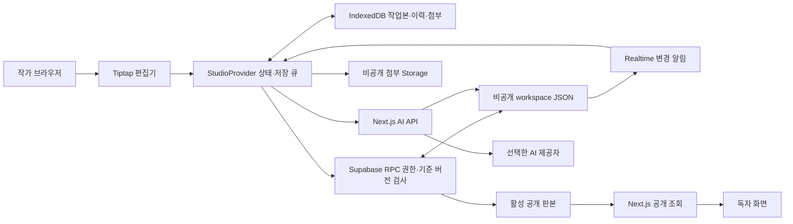

# 현재 구현 아키텍처

이 문서는 0.2.0 코드 기준이다. 향후 목표는 [기술 제안](technical-proposal.md)과 구분한다.

## 구성

| 영역 | 실제 사용 | 역할 |
|---|---|---|
| 앱 | Next.js 16 App Router, React, TypeScript | 화면, 공개 데이터 조회, AI 서버 API |
| UI | Tailwind CSS, Radix Dialog·Tooltip, Lucide, 자체 CSS | 편집 도구·패널·대화상자·아이콘 |
| 편집 | Tiptap / ProseMirror | 리치 문서, 각주 노드, 설정 링크, 문단 ID |
| 기기 저장 | IndexedDB + Dexie | 작업본, 전송 기록, 복구 이력, 첨부 바이트 |
| 클라우드 연결 | Supabase JS | Auth, PostgreSQL RPC·RLS, Storage, Realtime |
| 백업 | JSZip, Web Crypto SHA-256, Zod | ZIP 생성·검사·복원 |
| AI | 서버 `fetch` → Responses 형식 API | 장면 검토·구조화 수정 제안 |
| 테스트 | Node test runner + tsx, PGlite | 백업·AI 적용·실제 SQL 검증 |
| 배포 대상 | Vercel | 첫 운영 배포 Ready, 기본 클라우드 흐름 확인 |

Node.js 지원 범위는 `>=22 <25`다. pnpm은 `packageManager`의 11.19.0을 사용한다. 실제 설치 버전은 [pnpm-lock.yaml](../pnpm-lock.yaml)로 고정한다. 의존성 이름과 스크립트는 [package.json](../package.json)을 기준으로 한다.

## 데이터 경로

브라우저는 Supabase의 공개 키와 작가 세션을 사용한다. Supabase가 RLS와 RPC에서 권한을 확인한다. 모든 원고 저장을 Next.js 서버 API로 중계하는 구성은 아니다. AI 비밀 키는 Next.js 서버에서만 사용한다.

## 로컬 모드와 운영 모드

- 개발 환경에 Supabase 값이 없으면 `preview` 작업 공간을 IndexedDB에 만들고 샘플 작품을 연다.
- Supabase가 설정되면 작가 로그인과 `authors` 허용 목록을 확인한다. 기기 작업 공간은 `author:<계정 UUID>`다.
- `preview`와 로그인 작업본은 분리한다. 원고 이동은 ZIP 내보내기·복원으로 명시적으로 수행한다.
- 키 없는 운영 빌드는 집필실을 열지 않는다. `ALLOW_LOCAL_PREVIEW=true`는 로컬 운영 미리보기용이며 외부 배포에서는 사용하지 않는다.
- 공개 페이지는 클라우드가 있으면 서버의 활성 `publications`를 읽는다. 로컬 개발 미리보기는 기기 판본을 보여준다.

## 경로

| 경로 | 구현 |
|---|---|
| `/` | 공개 홈페이지: 집필·읽기·작품별 설정 소개와 데이터 이용 안내 연결 |
| `/privacy` | 원고 저장·Drive 백업·선택적 AI 검토의 데이터 이용 안내 |
| `/studio` | 로그인 또는 집필실 |
| `/library` | 공개 작품 목록 |
| `/read/[workId]` | 작품의 현재 공개 판본 |
| `/wiki/[workId]` | 해당 작품의 공개 설정 설명·등장 위치 |
| `POST /api/review` | 인증·저장 판본 검사 후 AI 검토 |

서재·독서·공개 설정집은 `force-dynamic`, 데이터 조회는 `cache: 'no-store'`다. 공개 판본 캐시, 검색 색인, CDN 판본 갱신 파이프라인은 아직 없다.

홈페이지와 데이터 이용 안내는 인증 없이 볼 수 있는 정적 설명 페이지다. 안내는 현재 코드의 저장·전송·접근 권한과 미연결 기능을 설명하며, Google OAuth 연결 자체를 수행하지 않는다. 이 두 페이지의 TypeScript 검사·운영 빌드와 로컬 브라우저의 내용·링크는 확인했다. 최신 운영 배포와 실제 Google 연결 검증은 남아 있다.

## 파일 안내

| 파일 | 맡는 일 |
|---|---|
| [model.ts](../src/lib/model.ts) | Zod 모델, 공개 판본 생성, 각주·설정 참조 추출 |
| [seed.ts](../src/lib/seed.ts) | 샘플 작품·문서 |
| [database.ts](../src/lib/database.ts) | IndexedDB, 로컬 기준 버전 검사, 복구 지점 |
| [cloud.ts](../src/lib/cloud.ts) | Supabase 클라이언트·RPC |
| [backup.ts](../src/lib/backup.ts) | ZIP 생성·검사·파싱 |
| [public-data.ts](../src/lib/public-data.ts) | 서버에서 활성 공개 데이터만 조회 |
| [ai.ts](../src/lib/ai.ts) | 응답 검증, 수정 제안 적용 |
| [studio-provider.tsx](../src/components/studio-provider.tsx) | 상태·기기 저장 큐·동기화·충돌·게시·첨부·복원 |
| [studio.tsx](../src/components/studio.tsx) | 집필실 탐색·탭·분할·속성·보드 |
| [rich-editor.tsx](../src/components/rich-editor.tsx) | 편집기와 사용자 정의 노드·링크 |
| [studio-dialogs.tsx](../src/components/studio-dialogs.tsx) | 백업·충돌·작품 생성·게시 대화상자 |
| [public-site.tsx](../src/components/public-site.tsx) | 서재·독서·공개 설정집 |
| [ai-review.tsx](../src/components/ai-review.tsx) | 검토 실행·자료 링크·제안 선택 적용 |
| [AI route](../src/app/api/review/route.ts) | 인증, 자료 범위, 호출 횟수, AI 요청 |
| [001_studio.sql](../supabase/migrations/001_studio.sql) | 테이블·권한·RPC·첨부 정책·Realtime |

## 변경할 때 유지할 규칙

원고 JSON을 복원 원본으로 사용한다. 설정·주석·문단은 ID로 연결하며 제목 변경으로 링크를 끊지 않는다. 공개 렌더러는 허용한 노드와 표시 요소를 React로 렌더링하며 원고 문자열을 그대로 HTML로 삽입하지 않는다.

편집기는 문서 ID와 복원 시점에 맞춰 다시 연다. 일상 자동 저장마다 편집기를 새로 만들면 커서와 한글 입력이 흔들릴 수 있다. 읽기 전용 상태 전환이 불필요한 `onUpdate`를 만들지 않도록 `setEditable(editable, false)`를 사용한다.

Supabase RPC는 기준 버전 검사를 유지한다. 재전송에서 같은 요청 ID에 다른 원고를 붙이지 않는다. 게시에는 저장 완료가 확인된 작업본만 사용한다. UI에서 패널을 숨기는 동작은 접근 권한의 근거가 아니다.

## 현재 기술 경계

저장·충돌·복원은 작업 공간 전체 단위다. 문서별 서버 테이블, CRDT, 자동 병합, 작업 큐, 벡터 검색, PWA는 없다. 외부 문서 변환·AI 3종·Drive/S3 서버 백업은 별도 모듈로 구현했으며 외부 API 자격 증명은 미연결이다. 샘플 데이터와 제한된 브라우저 흐름으로 확인한 첫 구현이며 장편 규모의 운영 성능 측정은 남아 있다.

## 문서 교환·AI·독립 백업 확장

[interchange.ts](../src/lib/interchange.ts)는 외부 HTML을 DOM에 삽입하지 않고 허용된 리치 노드로 변환한다. [InterchangeDialog](../src/components/interchange-dialog.tsx)는 미리보기·분류 후 새 ID로 추가한다. 전체 ZIP과 교환용 ZIP은 서로 다른 계약이다.

[ai-provider.ts](../src/lib/ai-provider.ts)는 제공자별 요청·완료 상태를 다루고 공통 결과를 검증한다. 서버 인증은 [server-auth.ts](../src/lib/server-auth.ts), 실제 스트림 바이트 제한은 [http.ts](../src/lib/http.ts)에 있다. 선택한 제공자 한 곳만 호출한다.

일일 백업은 [vercel.json](../vercel.json) → 인증된 cron → [offsite-backup-server.ts](../src/lib/offsite-backup-server.ts)의 서버 수집 → [offsite-backup.ts](../src/lib/offsite-backup.ts)의 ZIP·저장 후 검증 → Drive/S3 어댑터 순서다. 브라우저로 service_role·저장소 비밀을 보내지 않는다. 마지막 성공 표시는 실제 저장 파일 검증 이후에만 갱신한다. 구성과 미연결 경계는 [백업 안내](offsite-backup.md)에 있다.

Google OAuth 앱과 웹 클라이언트는 사용자가 생성하고 클라이언트 ID·비밀키를 복사해 보관했다. JSON 다운로드는 완료하지 않았다. 원래 비밀키가 비공개 도구 결과에 포함되어 연결 전에 교체할 예정이다. External Testing 앱의 Production 게시, Google 접근 승인·refresh token, Vercel 서버 변수와 실제 Drive 백업은 아직 미완료다.
