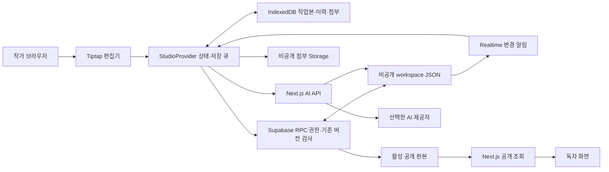

# 현재 구현 아키텍처

공유 휴지통은 Workspace.trash에 노트·문서 사본과 원래 위치를 보관한다. 활성 목록과 분리해 검색/AI 자료에서 제외하며 단독 복원은 다른 후속 편집을 유지한다. 첨부 메타데이터를 보존해 기존 ZIP/Drive 첨부 수집을 공유하고 영구 삭제만 이력 저장을 필수로 한다. [휴지통 계약](workspace-trash.md).

노트 정리 계층은 작품 소속 없이 Workspace.noteNavigation에 저장한다. DocumentTree에는 일시적인 표시 어댑터만 제공하며 작품을 생성하거나 works 배열에 넣지 않는다. AIChat은 작품 문서와 노트 대화를 공유하고 서버에서 대상과 참고 자료 권한을 각각 검사한다. 노트별 aiMessages도 같은 저장·충돌·백업 경로를 따른다.

개인 노트 공간을 작품 집필실 옆에 추가했다. Workspace.notes가 작품과 같은 상위 수준이고 linkedWorkIds로 작품을 참조한다. 편집기·저장 큐·IndexedDB·클라우드·백업 경로는 공유한다. 첨부는 workId 또는 noteId 중 하나에 소속하며 작품 가져오기는 새 첨부 ID와 비공개 문서를 만든다. `/studio#notes/<ID>`에서 열고 [개인 노트 안내](personal-notes.md)를 따른다.

이 문서는 0.2.1과 2026-10-03 집필 도구·AI 프리셋·문서 트리 코드 기준이다. 향후 목표는 [기술 제안](technical-proposal.md)과 구분한다.

## 구성

| 영역 | 실제 사용 | 역할 |
|---|---|---|
| 앱 | Next.js 16 App Router, React, TypeScript | 화면, 공개 데이터 조회, AI 서버 API |
| UI | Tailwind CSS, Radix Dialog·Popover·DropdownMenu·ContextMenu·Tooltip, Lucide, 자체 CSS | 편집 도구·패널·팝오버·메뉴·대화상자·아이콘 |
| 편집 | Tiptap / ProseMirror | 리치 문서, 각주 노드, 설정 링크, 문단 ID |
| 기기 저장 | IndexedDB + Dexie | 작업본, 전송 기록, 복구 이력, 첨부 바이트 |
| 클라우드 연결 | Supabase JS | Auth, PostgreSQL RPC·RLS, Storage, Realtime |
| 백업 | JSZip, Web Crypto SHA-256, Zod | ZIP 생성·검사·복원 |
| AI | 서버 `fetch` → OpenAI Responses / Claude Messages / Gemini generateContent | 문서별 대화·선택 자료·구조화 수정 제안 |
| 테스트 | Node test runner + tsx, PGlite | 백업·AI 적용·실제 SQL 검증 |
| 배포 대상 | Vercel | 첫 운영 배포 Ready, 기본 클라우드 흐름 확인 |

Node.js 지원 범위는 `>=22 <25`다. pnpm은 `packageManager`의 11.19.0을 사용한다. 실제 설치 버전은 [pnpm-lock.yaml](../pnpm-lock.yaml)로 고정한다. 의존성 이름과 스크립트는 [package.json](../package.json)을 기준으로 한다.

## 데이터 경로

[DocumentTree](../src/components/document-tree.tsx)는 폴더와 문서를 같은 부모 후보로 다루고, 손잡이의 Pointer Events 및 이동 팝오버에서 같은 순수 이동 함수를 호출한다. StudioProvider는 기존 자료의 트리를 속성 편집 전에 확정하고, 편집 뒤에는 트리와 `documents` 순서를 맞춘다. 클라우드 저장도 같은 변환을 거쳐 오래된 백업·대기 중 전송을 수용한다. 신규 저장소·동기화 통로는 추가하지 않는다. [문서 트리 계약](document-navigation.md).

집필실의 [문서 그래프](document-graph.md)는 현재 선택한 작품의 문서 배열을 `buildDocumentGraph`로 읽어 본문 `wikiLink`와 정확히 일치하는 유일한 시점 인물 관계를 계산한다. 필터·1~3단계 이웃 탐색·문서 200개/선 800개 제한 후 결정적인 배치를 만든다. 클라이언트 SVG에서 이동·선택·확대하고 Studio의 기존 문서 탭으로 연다. 서버 경로·공개 데이터·DB 스키마는 추가하지 않는다. 노드 위치와 보기 상태는 임시이며 백업에는 원본 링크·시점 값만 기존 방식으로 남는다.

브라우저는 Supabase의 공개 키와 작가 세션을 사용한다. Supabase가 RLS와 RPC에서 권한을 확인한다. 모든 원고 저장을 Next.js 서버 API로 중계하는 구성은 아니다. AI 비밀 키는 Next.js 서버에서만 사용한다.

## 로컬 모드와 운영 모드

- 개발 환경에 Supabase 값이 없으면 `preview` 작업 공간을 IndexedDB에 만들고 샘플 작품을 연다.
- Supabase가 설정되면 작가 로그인과 `authors` 허용 목록을 확인한다. 기기 작업 공간은 `author:<계정 UUID>`다.
- `preview`와 로그인 작업본은 분리한다. 원고 이동은 ZIP 내보내기·복원으로 명시적으로 수행한다.
- 키 없는 운영 빌드는 집필실을 열지 않는다. `ALLOW_LOCAL_PREVIEW=true`는 로컬 운영 미리보기용이며 외부 배포에서는 사용하지 않는다.
- 공개 페이지는 클라우드가 있으면 서버의 활성 `publications`를 읽는다. 로컬 개발 미리보기는 기기 판본을 보여준다.

## 경로

| 경로 | 구현 |
|---|---|
| `/` | 공개 홈페이지: 집필·읽기·작품별 설정 소개와 데이터 이용 안내 연결 |
| `/privacy` | 원고 저장·Drive 백업·선택적 AI 대화의 데이터 이용 안내 |
| `/studio` | 로그인 또는 집필실 |
| `/library` | 공개 작품 목록 |
| `/read/[workId]` | 작품의 현재 공개 판본 |
| `/wiki/[workId]` | 해당 작품의 공개 설정 설명·등장 위치 |
| `POST /api/review` | 인증·저장 판본 검사 후 AI 검토 |
| `POST /api/ai/chat` | 인증·원고 버전·선택 자료·이전 대화·하루 한도 검사 후 대화 |
| `GET /api/ai/providers` | 인증 후 제공자 연결 상태·모델·브라우저 키 보관 가능 여부, 비밀값 제외 |
| `POST/DELETE /api/ai/settings` | 같은 Origin·작가 인증 후 개인 연결의 암호화 쿠키 설정·해제 |

서재·독서·공개 설정집은 `force-dynamic`, 데이터 조회는 `cache: 'no-store'`다. 공개 판본 캐시, 검색 색인, CDN 판본 갱신 파이프라인은 아직 없다.

홈페이지와 데이터 이용 안내는 인증 없이 볼 수 있는 정적 설명 페이지다. 안내는 현재 코드의 저장·전송·접근 권한과 미연결 기능을 설명하며, Google OAuth 연결 자체를 수행하지 않는다. 이 두 페이지의 TypeScript 검사·운영 빌드·로컬 브라우저 확인 후 소스 `41114a1`의 Vercel Production Ready와 운영 내용·연결을 확인했다. 이는 초기 배포 기록이다. 이후 Google 연결·Drive 업로드·재다운로드·임시 IndexedDB 복원을 확인했으며 최신 결과는 [검증 기록](../VERIFICATION.md)을 따른다.

## 파일 안내

| 파일 | 맡는 일 |
|---|---|
| [model.ts](../src/lib/model.ts) | Zod 모델, 공개 판본 생성, 각주·설정 참조 추출 |
| [document-navigation-schema.ts](../src/lib/document-navigation-schema.ts) | 트리 스키마·ID·순환·깊이 검증 |
| [document-navigation.ts](../src/lib/document-navigation.ts) | 이전 자료 변환·이동·배열 정렬·정리 되돌리기·부분 내보내기 |
| [document-tree.tsx](../src/components/document-tree.tsx) | 중첩 탐색·하위 문서/폴더·사용자 대분류·드래그·이동 폼 |
| [002_document_navigation_guard.sql](../supabase/migrations/002_document_navigation_guard.sql) | 이전 클라이언트가 새 트리 필드를 지우는 저장 거절 |
| [seed.ts](../src/lib/seed.ts) | 샘플 작품·문서 |
| [database.ts](../src/lib/database.ts) | IndexedDB, 로컬 기준 버전 검사, 복구 지점 |
| [cloud.ts](../src/lib/cloud.ts) | Supabase 클라이언트·RPC |
| [backup.ts](../src/lib/backup.ts) | ZIP 생성·검사·파싱 |
| [public-data.ts](../src/lib/public-data.ts) | 서버에서 활성 공개 데이터만 조회 |
| [ai.ts](../src/lib/ai.ts) | 응답 검증, 수정 제안 적용 |
| [studio-provider.tsx](../src/components/studio-provider.tsx) | 상태·기기 저장 큐·동기화·충돌·게시·첨부·복원 |
| [studio.tsx](../src/components/studio.tsx) | 집필실 탐색·탭·분할·속성·보드 |
| [rich-editor.tsx](../src/components/rich-editor.tsx) | 편집기와 사용자 정의 노드·링크 |
| [studio-dialogs.tsx](../src/components/studio-dialogs.tsx) | 백업·충돌·작품 생성·게시 대화상자 |
| [public-site.tsx](../src/components/public-site.tsx) | 서재·독서·공개 설정집 |
| [ai-chat.tsx](../src/components/ai-chat.tsx) | 대화·추천 질문·자료 선택·수정 적용·메모·기록 |
| [ai-settings-dialog.tsx](../src/components/ai-settings-dialog.tsx) | 제공자·모델·마스킹 키·시스템 프롬프트 설정 |
| [ai-credentials.ts](../src/lib/ai-credentials.ts) | 계정·제공자에 묶인 AES-GCM 쿠키, HKDF, 30일 만료·기본 설정 선택 |
| [ai-credential-handler.ts](../src/lib/ai-credential-handler.ts) | Origin·8KiB JSON·쿠키 보안 속성·키 미반환 |
| [use-ai-system-prompt.ts](../src/components/use-ai-system-prompt.ts) | 이전 브라우저 지침의 명시적 가져오기 후보만 읽음 |
| [ai-prompt-editor.tsx](../src/components/ai-prompt-editor.tsx) · [ai-prompt-presets.ts](../src/lib/ai-prompt-presets.ts) | 계정 프리셋 편집·전환·저장 계약 |
| [ai-instructions.ts](../src/lib/ai-instructions.ts) | 공통 서버 규칙과 사용자 지침 분리 |
| [AI 대화 route](../src/app/api/ai/chat/route.ts) | 인증, 자료 범위, 원고 버전, 호출 횟수, AI 요청 |
| [ai-conversation.ts](../src/lib/ai-conversation.ts) | 질문·답변 저장 계약과 최근 대화 길이 제한 |
| [manuscript-fonts.ts](../src/components/manuscript-fonts.ts) | Next.js가 빌드 시 내려받아 자체 제공하는 한글 원고 글꼴 |
| [001_studio.sql](../supabase/migrations/001_studio.sql) | 테이블·권한·RPC·첨부 정책·Realtime |

## 변경할 때 유지할 규칙

원고 JSON을 복원 원본으로 사용한다. 설정·주석·문단은 ID로 연결하며 제목 변경으로 링크를 끊지 않는다. 공개 렌더러는 허용한 노드와 표시 요소를 React로 렌더링하며 원고 문자열을 그대로 HTML로 삽입하지 않는다.

편집기는 문서 ID와 복원 시점에 맞춰 다시 연다. 일상 자동 저장마다 편집기를 새로 만들면 커서와 한글 입력이 흔들릴 수 있다. 읽기 전용 상태 전환이 불필요한 `onUpdate`를 만들지 않도록 `setEditable(editable, false)`를 사용한다.

Supabase RPC는 기준 버전 검사를 유지한다. 재전송에서 같은 요청 ID에 다른 원고를 붙이지 않는다. 게시에는 저장 완료가 확인된 작업본만 사용한다. UI에서 패널을 숨기는 동작은 접근 권한의 근거가 아니다.

## 현재 기술 경계

저장·충돌·복원은 작업 공간 전체 단위다. 문서별 서버 테이블, CRDT, 자동 병합, 작업 큐, 벡터 검색, PWA는 없다. 외부 문서 변환·AI 3종·Drive/S3 서버 백업은 별도 모듈로 구현했으며 Drive 연결·앱 ZIP 복원은 확인했다. 실제 AI 호출과 R2 DB 저장·전체 복원은 아직 확인하지 않았다. 샘플 데이터와 제한된 브라우저 흐름으로 확인한 첫 구현이며 장편 규모의 운영 성능 측정은 남아 있다.

## 문서 교환·AI·독립 백업 확장

[interchange.ts](../src/lib/interchange.ts)는 외부 HTML을 DOM에 삽입하지 않고 허용된 리치 노드로 변환한다. [InterchangeDialog](../src/components/interchange-dialog.tsx)는 미리보기·분류 후 새 ID로 추가한다. 전체 ZIP과 교환용 ZIP은 서로 다른 계약이다.

[ai-provider.ts](../src/lib/ai-provider.ts)는 제공자별 요청·완료 상태를 다루고 공통 결과를 검증한다. 서버 인증은 [server-auth.ts](../src/lib/server-auth.ts), 실제 스트림 바이트 제한은 [http.ts](../src/lib/http.ts)에 있다. 선택한 제공자 한 곳만 호출한다.

대화는 기존 비공개 workspace의 `Work.aiConversations`에 선택 필드로 저장하므로 DB 마이그레이션이 없다. 기기 저장·동기화·ZIP·독립 백업의 기존 경로를 공유하고 공개 판본 생성은 대화를 제외한다. [대화 계약과 한도](ai.md)를 따른다. 원고 수정은 명시적인 적용과 버전 검사·복구 지점을 거치며, 변경된 본문은 열린 Tiptap 편집기에도 반영된다.

개인 AI 키는 workspace 밖의 계정·제공자별 암호화 HttpOnly 쿠키로 30일 보관한다. 서버가 복호화한 뒤 고정된 공식 제공자 URL의 요청 헤더에 넣고, 상태 응답에는 연결 여부·모델만 공개한다. 서버 환경 변수는 브라우저 연결이 없을 때의 기본값이다. 손상된 쿠키에서는 기본값 전환을 막는다. 프롬프트·선택 프리셋은 Workspace.aiPreferences에 저장하고 원고의 기기 저장·버전 검사·동기화·전체 백업 경로를 공유한다. 전체 ZIP·Drive ZIP·암호화 DB 수집 대상에 포함하고 공개 판본에서 제외한다. API 키는 이 데이터에 넣지 않는다. 새 테이블은 없으며 [003 보호 트리거](../supabase/migrations/003_ai_preferences_guard.sql)로 이전 클라이언트의 필드 제거를 거절한다. 응답 형식·원문 적용·자료 경계 규칙은 서버에서 유지한다.

일일 백업은 [vercel.json](../vercel.json) → 인증된 cron → [offsite-backup-server.ts](../src/lib/offsite-backup-server.ts)의 서버 수집 → [offsite-backup.ts](../src/lib/offsite-backup.ts)의 ZIP·저장 후 검증 → Drive/S3 어댑터 순서다. 브라우저로 service_role·저장소 비밀을 보내지 않는다. 마지막 성공 표시는 실제 저장 파일 검증 이후에만 갱신한다. 구성과 미연결 경계는 [백업 안내](offsite-backup.md)에 있다.

Google OAuth 앱·웹 클라이언트는 사용자가 생성했다. 새 비밀키 보관·기존 키 비활성화, 실제 공개 URL·도메인과 `drive.file` 저장, 앱의 프로덕션 상태를 확인했다. 첫 교환의 `invalid_grant` 보고 이후 재승인·Refresh token 보관은 사용자가 완료를 보고했다. 토큰 값은 읽지 않았다. 사용자는 Vercel Production에 Google 연결값 3개를 입력·저장했다고 보고했다. 이후 서버 설정·운영 Drive 백업 성공·재다운로드·임시 IndexedDB 복원을 확인했다. 실제 AI 호출은 미검증이다. 날짜별 근거는 [검증 기록](../VERIFICATION.md)을 따른다.

## 원고 편집 확장 (2026-10-04)

[editor-extensions.ts](../src/lib/editor-extensions.ts)는 표·첨자·강조·각주/설정 링크·안정된 문단 ID·문단 속성을 공유한다. [editor-search.ts](../src/lib/editor-search.ts)는 ProseMirror 텍스트 위치와 Decoration을 사용하고 검색 강조는 원고에 저장하지 않는다. [manuscript-format.ts](../src/lib/manuscript-format.ts)는 편집기·독서·교환 파일의 안전한 서식 변환을 공유한다. [편집 안내](editor-tools.md). 본문 노드 추가 외에 DB·서버 저장 방식·게시 권한·AI 프롬프트는 바꾸지 않았다.
