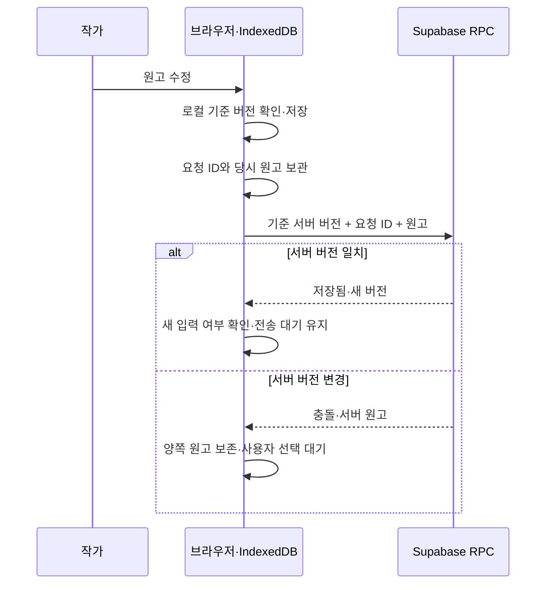

# 저장·동기화·충돌

## 개인 노트

개인 노트는 작품과 같은 계정 작업 공간 JSON·저장 큐·기준 버전·충돌·복구 이력을 사용한다. 노트별 독립 동기화나 자동 병합은 없다. 충돌 화면은 양쪽 노트 개수와 앞 8개 본문 일부도 보여주며 전체 내용은 양쪽 ZIP에 남긴다. [노트 보호 SQL](../supabase/migrations/20261004063340_independent_notes_guard.sql)은 기존 notes 배열의 누락을 차단한다. [노트 계약](personal-notes.md).

구현은 [studio-provider.tsx](../src/components/studio-provider.tsx), [database.ts](../src/lib/database.ts), [cloud.ts](../src/lib/cloud.ts), [SQL](../supabase/migrations/001_studio.sql)에 있다. 실제 Supabase에 SQL과 Realtime 대상 테이블을 설치했다. 작가 세션의 저장·새로고침과 서버 쪽 시험 메모 변경의 자동 반영을 확인했다. 두 기기의 오프라인 동시 수정·충돌과 원격 첨부 복원은 미검증이다.

## 저장 순서

1. 사용자의 수정으로 화면 상태를 갱신한다.
2. 직렬 저장 큐에서 IndexedDB에 기록한다. 같은 origin의 기준 `localVersion`이 달라졌으면 쓰기를 거절한다.
3. 기기 저장 성공 후 다른 탭에 변경 알림을 보내고 클라우드 전송을 예약한다.
4. 입력이 멈춘 뒤 약 1.5초에 전송한다. 계속 입력하더라도 12초 간격 동기화 시도가 있다. 브라우저 타이머의 지연이 있어 정확한 시간 보장은 아니다.
5. 전송 직전 요청 ID·기준 서버 버전·전송할 원고를 기기에 보관한다.
6. 서버가 소유자와 기준 버전을 확인해 저장하거나 충돌을 반환한다.
7. 성공 확인 후 `cloudVersion`을 갱신한다. 전송 중 새 입력이 있었으면 `dirty=true`를 유지하고 새 원고를 다시 전송한다.

‘기기에 저장됨’은 서버 반영 확인이 아니다. 서버의 성공 응답을 받은 뒤에만 ‘클라우드 동기화됨’으로 표시한다.

## 재전송

응답을 놓친 요청은 같은 ID와 같은 payload로 재전송한다. 재시도 시 최신 화면 내용으로 payload만 바꾸면 중복 요청 확인이 깨지므로 `pendingRequest.data`를 그대로 사용한다.

서버는 같은 요청 ID의 payload 해시가 다르면 거절한다. 이미 반영한 요청이고 서버가 그 반영 버전에 머물러 있으면 같은 성공을 반환한다. 이후 다른 저장이 진행되었다면 충돌을 반환해 오래된 확인으로 최신 원고를 덮지 않게 한다.

## 다른 창·기기에서 변경한 경우

- 같은 브라우저 origin의 탭은 `BroadcastChannel`로 변경 사실을 알린다.
- 다른 기기는 Supabase Realtime `workspaces UPDATE` 알림 후 서버 버전을 다시 조회한다.
- 창 활성화와 온라인 복귀에서도 조회·재전송한다. Realtime 알림 자체에만 의존하지 않는다.
- 기기에 저장 대기·전송 중인 수정이 있으면 다른 원고로 즉시 교체하지 않는다.
- 변경 알림이 누락되어도 다음 쓰기의 기준 버전 검사가 오래된 덮어쓰기를 막는다.

Realtime은 변경 알림이며 문장별 병합 기능이 아니다.

## 충돌 해결의 현재 범위

예: 노트북에서 서버 버전 12를 열고 수정하는 동안 다른 기기에서 13을 저장했다면, 12를 기준으로 한 저장은 거절된다. 기기 원고와 서버 원고를 모두 남기고 선택을 받는다.

충돌 중에는 편집·게시를 막는다. 해결 전에 양쪽 작업 공간을 각각 복구 지점으로 보관하고, 사용자가 고른 **작업 공간 전체**를 새 작업본으로 쓴다. 선택하지 않은 자료는 이력에서 확인할 수 있다.

현재 대화상자의 간단한 미리보기는 모든 변경 문서를 비교하지 않는다. 서로 다른 작품·문서의 변경도 전체 JSON 충돌에 포함되므로 선택 전에 [백업·복구 안내](backup-restore.md)에 따라 양쪽 내용을 보존·확인한다. 문서별 비교와 수동 병합 화면은 후속 개발이다.

## 오프라인과 실패

이미 열린 원고는 인터넷이 끊겨도 기기에 저장한다. 연결이 돌아오면 서버 버전을 확인하고 재전송한다. 첨부는 현재 별도 업로드 대기열이 없어 클라우드 모드에서 연결이 필요하다. 실패한 첨부의 기기 Blob이 남을 수 있으며 자동 정리는 없다.

기기 저장이 실패하면 화면의 최신 내용이 디스크에 저장되었다고 보장할 수 없다. 창을 유지한 상태에서 ZIP 또는 본문 사본을 확보하고 저장 공간·브라우저 설정을 확인한다. 자세한 대응은 [운영 안내](operations.md)를 따른다.

현재는 오프라인에서 사이트를 새로 여는 PWA, 브라우저 종료 후 전송, 자동 병합, 공동 편집을 제공하지 않는다. 클라우드 미확인 수정만 남은 상태의 모든 종료를 경고하는 기능도 보장하지 않는다. 기기를 바꾸기 전 상태 표시를 확인한다.

## AI 프롬프트 동기화

프리셋 저장·전환·재설정은 Workspace.aiPreferences를 변경하므로 위 기기 저장·클라우드 큐·전체 버전 검사를 따른다. 동일 계정의 모든 작품·기기에서 같은 라이브러리·선택을 사용한다. 타이핑만 한 초안은 저장되지 않는다. 저장·적용 후 클라우드 상태를 확인하고 기기를 바꾼다. 오프라인 변경은 기기에 보관하며 자동 병합은 없다.

다른 창이 편집 중 프리셋을 바꾸면 최신 내용 또는 사본 저장을 안내하고 오래된 덮어쓰기를 막는다. 질문의 ID·지침이 서버 선택과 다르면 호출 예약 전에 409를 반환한다. API 키는 브라우저 쿠키에 남고 동기화하지 않는다.

003 안내가 나오면 미전송 원고를 먼저 ZIP/본문 사본으로 보관하고 집필실을 새로 연다. 이전 브라우저 localStorage의 지침은 자동으로 어느 계정에도 복사하지 않는다. AI 설정에서 명시적 불러오기·저장을 거친다.

## 게시·복원·로그아웃

- **게시:** 기기 저장 큐 완료 → 클라우드 저장 확인 → 서버 판본 생성 → 기기 판본 사본 갱신 순서다. 충돌·미전송 수정이 남으면 게시하지 않는다.
- **복원:** 현재 원고를 이력에 남긴 뒤 작업 공간을 바꾸고 일반 저장 경로를 탄다. 서버에 반영된 확인은 저장 상태로 확인한다. 클라우드의 기존 공개판은 재게시 전까지 유지된다.
- **로그아웃:** 기기 저장 완료와 동기화를 시도한 뒤 로그아웃한다. 서버 확인이 실패했다면 남은 기기 작업을 이후 같은 계정으로 열어 확인해야 한다.

로그인 계정의 최초 작업 공간에는 샘플 작품이 들어갈 수 있다. 초기화만으로 샘플을 외부에 공개하지는 않는다. 공개 테이블에는 게시 RPC로 별도 판본을 생성해야 한다.

## 문서 정리 구조의 저장

문서·폴더·사용자 대분류는 `Work.navigation`에 저장하고 원고와 같은 기기 저장 큐·workspace RPC·ZIP 경로를 따른다. 구조 이동도 작업 공간 전체의 기준 버전 검사에 포함된다. 다른 기기에서 동시 정리한 구조를 자동 병합하지 않는다. 정리 되돌리기는 같은 세션의 마지막 구조 변경 하나이며 본문 되돌리기와 별도다.

서버의 `preserve_document_navigation` 트리거는 새 구조가 있던 작품에서 그 필드를 통째로 제거하는 이전 클라이언트 저장을 거절한다. 안내가 나오면 현재 기기의 미전송 원고를 ZIP/본문 사본으로 보관하고 집필실을 새로 연다. 새 클라이언트는 이전 백업과 오래된 저장 대기 자료에도 구조를 생성한 뒤 전송한다. 같은 요청 ID의 재전송에는 결정적으로 생성한 동일 트리를 사용한다.

## 원고의 새 편집 서식

표·첨자·강조·문단 정렬/간격은 NovelDocument.content에 저장하며 기존 기기 큐·workspace RPC·버전 충돌 검사를 따른다. 별도 동기화 서버나 SQL 변경은 없다. 표시 글꼴·크기·통계 기준은 localStorage 보기 설정으로 계정에 전송하지 않는다. [저장/호환 경계](editor-tools.md#보관호환-경계).
