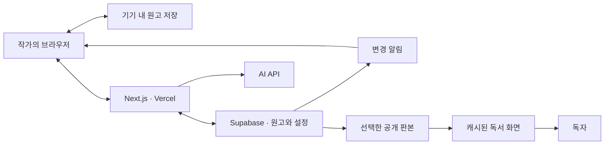

# 개인 소설 사이트 기술 구성

목표 기술 제안 / 2026-10-01. 원래 권장 구성과 비용 근거를 보존한 문서다. 현재 로컬 구현이 있으나 계정 연결·배포는 완료하지 않았다. 문서별 저장, 공개 캐시, 스트리밍 AI, 독립 자동 백업 등은 목표다. 실제 구현은 [아키텍처](architecture.md)와 [구현 상태](status.md)를 기준으로 한다.

## 권장 스택

| 영역 | 선택 | 맡는 일 |
|---|---|---|
| 웹 앱 | Next.js App Router + React + TypeScript | 집필실, 공개 독서 화면, 설정집, 서버 API |
| 화면 구성 | Tailwind CSS + 필요한 shadcn/ui 구성 요소 | 탭, 탐색기, 분할 패널, 대화상자 등. 제품 화면은 별도로 설계 |
| 원고 편집 | Tiptap / ProseMirror | 구조화 원고, 각주, 설정 링크, 문단 ID. 장면별 문서로 구성 |
| 웹 호스팅 | Vercel | 앱 배포, HTTPS, 공개 페이지 캐시, 서버 API |
| 원고·설정 데이터 | Supabase PostgreSQL | 작업본, 판본, 작품 관계, 공개 판본 |
| 작가 로그인 | Supabase Auth | 작가 계정만 허용. 공개 회원가입 없음 |
| 첨부 파일 | Supabase Storage | 표지·설정 이미지. 비공개 첨부와 공개 첨부의 접근 정책 구분 |
| 변경 알림 | Supabase Realtime | 다른 탭·기기에 변경 사실 알림 |
| 기기 내 저장 | IndexedDB + Dexie | 복구용 작업본과 전송 대기 기록 |
| AI | 서버 API → 선택한 AI 제공자 | 작품별 자료 검색·문단 검토·수정 제안 |

Supabase 데이터베이스는 서울 리전(ap-northeast-2)을 기본 제안으로 둔다. 웹 서버의 실행 지역도 데이터베이스와 가까운 곳을 선택한다. 서버/DB 지역과 독자용 CDN은 별개다.

Tiptap의 편집기와 JSON 저장을 사용한다고 유료 협업 서비스를 반드시 구매해야 하는 것은 아니다. 첫 버전은 자체 저장 API를 사용한다. 위키도 별도 위키 엔진을 붙이지 않고 같은 데이터베이스에 작품별 문서·별칭·관계·판본을 저장한다.

## 호스팅과 운영

- 도메인 하나로 공개 서재와 `/studio` 집필실을 제공한다. 집필실은 로그인과 서버 권한 검사를 거친다.
- 사이트 도메인은 등록업체에서 구입해 Vercel에 연결한다. 이 구성에서는 Supabase의 유료 사용자 지정 API 도메인이 필요하지 않다.
- 컴퓨터를 끄더라도 사이트와 서버 저장은 계속 운영된다.
- 소스 코드는 비공개 Git 저장소에 보관하고 데이터베이스 변경 이력도 관리한다. 원고는 소스 저장소에 넣지 않는다.
- 공개 페이지는 선택한 공개 판본으로 생성하고 캐시한다. 게시가 성공했을 때 해당 작품의 공개 캐시를 갱신한다.
- 관리자 권한은 화면에 메뉴를 숨기는 방식으로 처리하지 않는다. 서버 API와 PostgreSQL RLS에서 확인하고, 관리자 비밀 키와 AI 키는 서버에만 둔다.
- 미리보기 배포에서는 운영 원고를 수정하지 못하게 한다. 개발은 로컬 데이터 또는 별도 시험 프로젝트를 사용한다. 추가 유료 프로젝트는 비용이 늘어난다.

## 자동 저장과 기기 간 동기화

목표는 클라우드 원고를 기준으로 삼되 기기 내 복구본을 함께 보관하는 것이다. IndexedDB/Dexie는 기기 내 저장 도구이며 Supabase와의 동기화는 별도로 구현한다. 아래 장면별 요청은 후속 구조다. 현재는 전체 작업 공간 JSON을 전송하며 재시도·기준 버전 검사 흐름은 [동기화 문서](synchronization.md)에 기록했다.

1. 입력 내용을 짧은 간격으로 기기에 저장한다. 한글 조합 중 문서를 다시 로드하거나 커서를 이동시키지 않는다.
2. 입력이 잠시 멈추면 서버로 전송한다. 초기 제안은 1~2초이며, 계속 입력할 때도 최대 대기 시간을 두고 저장한다.
3. 요청에는 장면 ID, 기준 서버 버전, 요청 고유 ID, 변경 내용을 포함한다.
4. 서버는 권한을 확인하고 기준 버전이 현재 버전과 같을 때만 한 트랜잭션에서 저장한다. 이미 처리한 요청의 재전송은 중복 반영하지 않는다.
5. 서버의 확인을 받은 원고만 ‘클라우드 동기화됨’으로 표시한다. 전송 중 새 입력이 생겼다면 새 내용이 아직 전송 대기 중임을 유지한다.
6. 다른 기기는 변경 알림을 받은 뒤 서버 버전을 조회한다. 기기에 미전송 수정이 있으면 현재 문서를 자동으로 덮어쓰지 않는다.
7. 재접속·창 활성화 때도 버전을 확인한다. 변경 알림을 놓쳐도 최신 상태를 확인할 수 있어야 한다.

문서별 요청은 순서대로 처리한다. 기기 내에는 기준 원고와 최신 작업본을 보관하고 서버 저장 확인 후 기준을 갱신한다. 인터넷이 끊기면 현재 작업본을 기기에 보존하고, 연결이 돌아왔을 때 버전을 비교한 뒤 전송한다.

예: 노트북에서 버전 12를 열어 오프라인으로 수정하는 동안 휴대폰에서 버전 13을 저장했다면, 노트북 원고로 버전 13을 조용히 덮어쓰지 않는다. 서버본과 기기본을 모두 보존하고 비교 화면에서 합치거나 새 작업본으로 남긴다. 삭제와 장면 이동에도 같은 버전 확인 원칙을 적용한다.

저장 상태는 ‘이 기기에 저장됨 / 클라우드 동기화 중 / 클라우드 동기화됨 / 연결 끊김 / 충돌 확인 필요’로 구분한다. 클라우드 저장이 확인되지 않은 원고는 다른 기기에서 이어 쓸 수 있다고 표시하지 않는다.

이 방식은 이미 열린 원고를 연결 끊김 중에도 보존하는 범위다. 인터넷 없이 사이트 자체를 다시 열고 캐시된 작품을 편집하는 PWA는 후속 단계로 구현한다. 열어보지 않은 문서의 오프라인 접근이나 브라우저 종료 후 계속되는 업로드를 보장하지 않는다. 기기 내 데이터도 브라우저 데이터 삭제 등으로 사라질 수 있다.

여러 기기에서 같은 장면을 동시에 고치는 경험이 실제로 필요하면 Yjs + Hocuspocus 또는 관리형 협업 서비스를 추가한다. 첫 버전은 한 작가가 기기를 바꾸며 사용하는 흐름에 맞추고, 충돌 시 모든 원고를 보존한다.

## 집필과 공개의 분리

클라우드 동기화는 비공개 작업본을 갱신한다. 공개 사이트는 작가가 선택한 장면·주석·공개 설정의 고정 판본만 읽는다. 게시 처리 전에 해당 원고의 서버 저장 완료를 확인한다.

게시할 때 원고와 연결 자료를 검증하고 공개 판본을 생성한 뒤 활성 공개 판본을 원자적으로 전환한다. 실패하면 기존 공개판이 유지된다. 작업본 수정, 설정집의 비밀 메모 추가, AI 검토는 이미 게시한 원고를 바꾸지 않는다.

## AI 실행

짧은 문단 검토와 질문은 서버 API에서 호출하고 결과를 스트리밍한다. 원고와 설정의 필요한 범위를 제공하며, 수정 제안은 검토 대상 판본과 연결한다. 적용 전 차이를 보여주고 사용자가 선택한다.

장편 전체 검토처럼 오래 걸리는 작업은 저장된 작업 기록과 별도 작업 실행기로 처리한다. 브라우저 연결이나 서버 메모리에만 진행 상황을 두지 않는다. AI 실패·비용 한도 도달은 원고 저장에 영향을 주지 않아야 한다. 제공자와 모델, 작업 실행 서비스는 첫 AI 범위와 예산을 정할 때 확정한다.

## 백업과 이동 가능성

동기화, 판본 이력, 운영 백업을 모두 제공한다.

- 기기 내 복구본: 전송 실패나 새로고침에 대비한다.
- 사이트 판본 이력: 이전 원고를 새 작업본으로 복원한다. 자동 저장 요청마다 영구 판본을 만들지는 않는다.
- Supabase DB 백업: Pro는 일일 백업을 7일 보관한다. 무료 플랜에는 자동 백업이 포함되지 않는다.
- 별도 작품 내보내기: JSON + Markdown/TXT + 주석·설정 관계 + 이미지와 첨부를 ZIP으로 내려받는다. 개발 시 재가져오기와 복원을 검증한다.

Supabase의 데이터베이스 백업은 Storage에 저장한 실제 이미지·파일을 포함하지 않는다. 첨부 파일은 전체 내보내기 또는 별도 복사로 함께 백업해야 한다. 주 저장소와 독립된 곳에도 백업본을 남긴다.

## 초기 운영비

2026-10-01의 이전 설계 작업에서 확인한 공식 가격, USD 기준. 기본 크기 데이터베이스 프로젝트 1개와 포함 사용량을 가정한다. 도메인·세금·AI·추가 프로젝트·초과 사용량은 별도다. 이번 문서 정리는 가격을 재검증한 작업이 아니며 실제 구매·운영 연결 시 아래 공식 가격과 사용 조건을 다시 확인한다.

| 구성 | 기본 월 비용 | 적용 시점 |
|---|---:|---|
| Vercel Hobby + Supabase Free | $0 | 비상업적 시험 운영 |
| Vercel Hobby + Supabase Pro | $25부터 | Vercel Hobby 사용 조건을 충족하는 개인 운영 |
| Vercel Pro + Supabase Pro | $45부터 | 개발자 좌석 1개, 상업적 운영 등 |

Vercel Hobby는 개인의 비상업적 용도에 한정된다. 개인 작가 사이트여도 책 판매·사업 활동과의 관계에 따라 자격을 확인해야 한다. Supabase Free는 낮은 활동 상태가 약 1주 이어지면 일시정지될 수 있고 자동 DB 백업이 없다. 실제 원고를 지속적으로 맡기는 단계에서는 Supabase Pro를 권장한다.

우선 무료 환경에서 저장·복구·게시 흐름을 개발한 뒤, 실제 원고를 옮길 때 데이터베이스 운영 플랜을 적용한다. 서비스를 직접 서버에 설치하는 방식도 가능하지만, 현재 제안은 서버 업데이트·인증·백업 운영 부담을 줄이는 관리형 구성이다.

## 공식 근거

- [Next.js App Router](https://nextjs.org/docs/app)
- [Tiptap 문서 저장](https://tiptap.dev/docs/editor/core-concepts/persistence)
- [Dexie와 IndexedDB](https://dexie.org/docs/Dexie/Dexie)
- [Supabase 변경 알림](https://supabase.com/docs/guides/realtime/postgres-changes)
- [Supabase 접근 권한](https://supabase.com/docs/guides/database/postgres/row-level-security)
- [Supabase 리전](https://supabase.com/docs/guides/platform/regions)
- [Supabase 가격](https://supabase.com/pricing)
- [Supabase 무료 프로젝트 일시정지](https://supabase.com/docs/guides/platform/free-project-pausing)
- [Supabase 백업 범위](https://supabase.com/docs/guides/platform/backups)
- [Vercel 가격](https://vercel.com/pricing)
- [Vercel Hobby 조건](https://vercel.com/docs/plans/hobby)
- [Hocuspocus 협업 서버](https://tiptap.dev/docs/hocuspocus/getting-started/overview)
